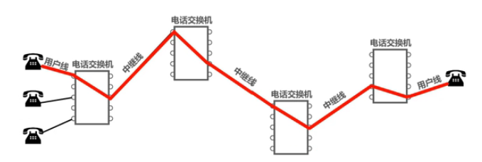

# 《计算机网络》
## 1.1 计算机网络在信息时代的作用是什么？
计算机网络已经由一种信息基础设施发展成为一种重要的信息服务基础设施。

[中国互联网络信息中心](https://www.cnnic.net.cn/)
## 1.2 因特网概述
1.什么是网络、互联网、因特网，区别是什么？
+ 网络。网络(Network)是由若干结点和连接这些结点的路由器组成的。
+ 互联网。多个网络通过路由器连接，就构成了一个覆盖范围更大的网络，即互联网。
+ 因特网。是世界上最大的互联网。

2.普通用户是如何接入互联网的？

ISP(因特网服务提供者)。ISP可以从因特网管理机构申请IP地址、同时拥有通信线路、路由器等网络设备。个人或机构通过向ISP缴纳费用获取IP地址，主机必须有IP地址才能通信，这样就可以通过该ISP接入因特网。

## 1.3 三种交换方式
+ 电路交换。电话机刚问世时，人们想如果想要把 n 个电话机用电线两两相连，则需要 n*(n - 1)/2 根电线，这时就需要一个中间设备，即电话交换机。可以把电话交换机看成一个有多个开关的开关器，每一部电话都连接到电话交换机上，从而大大减少连接的电话线数量。当电话机的数量增多时，则需要很多彼此连接起来的电话交换机来完成全网的交换任务，用这样的方法就构成了覆盖全世界的电信网。

  电话交换机接通电话线的方式称为电路交换。

  从通信资源的分配角度来看，交换就是按照某种方式动态的分配传输线路的资源。

  电路交换的三个步骤：

  ① 建立连接（分配通信资源）。

  ② 通话（一直占用通信资源）。

  ③ 释放连接（归还通信资源）。
  >使用电路交换来传输计算机数据是否可行？

  >可行。但是线路的传输效率很低。因为计算机的传输数据是突发式的出现在传输线路上的。试想，当用户输入和编辑一份文件时，用户所占用的通信资源暂时未被利用，该通信资源也不能被其他用户利用，通信资源就会被白白浪费。因此，计算机网络通常采用分组交换，而不是电路交换。

+

