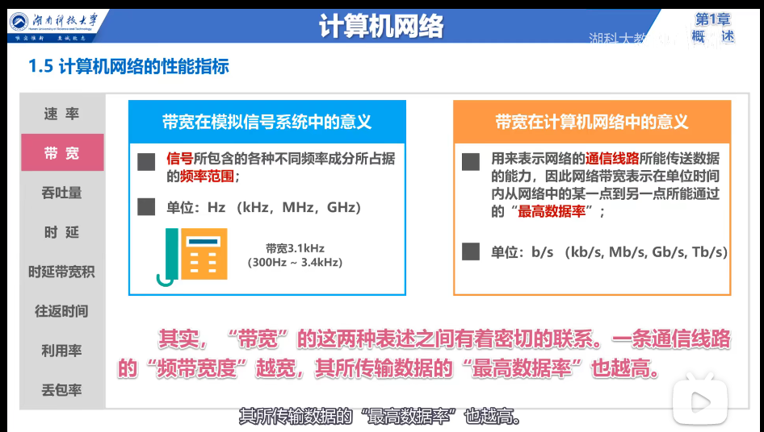

# 《计算机网络》
## 1.1 计算机网络在信息时代的作用是什么？
计算机网络已经由一种信息基础设施发展成为一种重要的信息服务基础设施。

[中国互联网络信息中心](https://www.cnnic.net.cn/)
## 1.2 因特网概述
1.什么是网络、互联网、因特网，区别是什么？
+ 网络。网络(Network)是由若干结点和连接这些结点的路由器组成的。
+ 互联网。多个网络通过路由器连接，就构成了一个覆盖范围更大的网络，即互联网。
+ 因特网。是世界上最大的互联网。

2.普通用户是如何接入互联网的？

ISP(因特网服务提供者)。ISP可以从因特网管理机构申请IP地址、同时拥有通信线路、路由器等网络设备。个人或机构通过向ISP缴纳费用获取IP地址，主机必须有IP地址才能通信，这样就可以通过该ISP接入因特网。

## 1.3 三种交换方式
+ 电路交换。

电话机刚问世时，人们想如果想要把 n 个电话机用电线两两相连，则需要 n*(n - 1)/2 根电线，这时就需要一个中间设备，即电话交换机。可以把电话交换机看成一个有多个开关的开关器，每一部电话都连接到电话交换机上，从而大大减少连接的电话线数量。当电话机的数量增多时，则需要很多彼此连接起来的电话交换机来完成全网的交换任务，用这样的方法就构成了覆盖全世界的电信网。

  电话交换机接通电话线的方式称为电路交换。

  从通信资源的分配角度来看，交换就是按照某种方式动态的分配传输线路的资源。

  电路交换的三个步骤：

  ① 建立连接（分配通信资源）。

  ② 通话（一直占用通信资源）。

  ③ 释放连接（归还通信资源）。
  >使用电路交换来传输计算机数据是否可行？

  >可行。但是线路的传输效率很低。因为计算机的传输数据是突发式的出现在传输线路上的。试想，当用户输入和编辑一份文件时，用户所占用的通信资源暂时未被利用，该通信资源也不能被其他用户利用，通信资源就会被白白浪费。因此，计算机网络通常采用分组交换，而不是电路交换。

+ 分组交换。

在因特网中，主机H1向主机H2发送消息，该消息数据我们称为报文。该报文在发送之前会先被分割成一个个更小的等长数据段，每一个数据段再拼接上控制信息组成的首部，就构成了一个分组，也可简称为“包”，首部称为包头。包头中包含了分组的目的地址等信息；分组经过分组交换机（即路由器），分组交换机在收到一个分组后，先将分组暂时存储下来，再检查其首部，按照首部中的目的地址进行查表转发，找到合适的接口，通过该接口将分组转发给下一个分组交换机；最后到达主机H2，主机H2在收到分组后，去掉首部、将数据段组合，还原出原始报文。

分组交换过程中各方的职能：

发送方：构造分组、发送分组。

分组交换机（路由器）：存储转发分组。

接收方：接收分组、还原报文。

>电路交换、报文交换、分组交换对比

+ 电路交换。需要先建立连接，然后才能数据传送，通信完成要释放连接。一旦建立连接，中间的各结点交换机就是直通形式的，比特流可以直达终点。

优点：

① 通信时延小。通信线路为通信双方专用、数据直达。当连续传输大量数据时，这一优点非常明显。

② 有序传输。通信双方只有一条传输线路，数据只在这一条线路上传输，因此不存在失序问题。

③ 没有冲突。不同的通信双方拥有不同的信道，不会出现争用物理信道的问题。

④ 适用范围广。既适用于传输模拟信号，也适用于传输数字信号。

⑤ 实时性强。得益于通信时延小的优点。

⑥ 控制简单。

缺点：

① 建立连接时间长。

② 线路独占，使用效率低。

③ 灵活性差。只要连接所建立的物理通路中，任何一点出现了故障，就必须重新拨号建立新的连接。

④ 难以规格化。电路交换时，数据直达，不同速率、不同规格、不同类型的终端很难进行相互通信，也难以在通信过程中进行差错控制。

+ 报文交换。不需要建立连接，随时可以发送报文给相邻结点交换机，结点交换机对整个报文进行存储查表转发。由于不限制报文大小，因此要求各结点交换机都要有较大的缓存空间。

优点：

① 无需建立连接。没有建立连接的时延，用户可以随时发送报文。

② 动态分配线路。当发送方把报文发送给结点交换机时，结点交换机先存储整个报文，然后选择一条合适的空闲线路将报文发送出去。

③ 提高线路可靠性。当某条传输路径出现故障时，会选择另一条路径传输数据。

④ 提高线路利用率。通信双方不是固定占用一条通信线路，而是在不同的时间分段部分占用物理线路。

⑤ 提供多目标服务。一个报文可以发送到多个目的地址，这在电路交换中是很难实现的。

缺点：

① 引起了转发时延。这是因为报文在结点交换机上要经历存储转发的过程。

② 需要较大的存储缓存空间。这是因为报文交换对报文的大小没有限制。

③ 需要传输额外的信息量。这是因为报文需要携带目标地址、源地址等信息。

+ 分组交换机。也不需要建立连接，随时可以发送分组给相邻结点交换机，构成原始报文的分组依次在各结点交换机上存储转发。相比报文交换，减少了转发时延、还可以避免过长的报文长时间占用链路、同时也有利于进行差错控制。

优点：

① 无需建立连接。没有建立连接时延，用户可以随时发送分组。

② 线路利用率高。通信双方不是固定占用一条通信线路，而是在不同的时间分段部分占用物理线路。

③ 简化了存储管理。相对于报文交换，分组的长度固定，相应的缓冲区大小也固定，管理起来相对容易。

④ 加速传输。由于分组是逐个传输的，因此后一个分组的存储和前一个分组的转发是可以同时进行的。

⑤ 减少出错概率和重发数据量。因为分组比报文小，因此出错概率必然会减小，即使分组出错，也只需重传出错的部分，这比重传整个报文的数据量小很多。

缺点：

① 引起了转发时延。

② 需要传输额外的信息量。

③ 对于数据报服务，存在失序、丢失或重复分组的问题；对于虚电路服务，存在呼叫建立、数据传输和虚电路释放三个过程。

## 1.5 计算机网络的性能指标

速率、带宽、吞吐量、时延
+ 速率：连接在计算机网络上的主机在数字信道上传送比特的速率，也成为比特率，或数据率。比特是计算机中数据量的单位，一个比特就是二进制数字中的一个 1 或 0 。

+ 带宽：带宽在计算机网络中，用来表示网络的通信线路所能传送数据的能力，因此网络带宽表示在单位时间内从网络中的某一点到另一点所能通过的最高速率；带宽在模拟信号系统中指，信号所包含的各种不同频率成分所占据的频率范围。

+ 吞吐量：表示在单位时间内通过某个网络的数据量。吞吐量常用于对现实世界中的网络的一种测量，以便知道实际上到底有多少数据量能够通过网络。吞吐量受网络的带宽或额定速率的限制。

+ 时延：包括发送时延、传播时延、处理时延。

+ 时延带宽积：发送时延 * 带宽。
+ 往返时间：双向交互一次所需的时间。
+ 利用率：包括信道利用率和网络利用率。信道利用率是指信道百分之几的时间是被利用的；网络利用率是全网络的信道利用率的加权平均。

+ 丢包率：即分组丢失率。指一段时间内丢失的分组数量与分组总数量的比率。

## 1.6 计算机网络体系结构
### 1.6.1 常见计算机网络体系结构
为了使不同体系结构的计算机网络都能互联，国际标准化组织，提出了“开放系统互联参考模型”，即 OSI 。

OSI 体系结构：是一个七层协议的体系结构，从下往上依次是：物理层、数据链路层、网络层、运输层、会话层、表示层、应用层。

因特网的 TCP/IP 体系结构：是一个四层协议的体系结构。从下往上依次是，网络接口层、网际层、运输层、应用层。

原理体系结构：是一个五层协议的体系结构，它综合了 OSI 和 TCP/IP 体系结构的优点，从下往上依次是，物理层、数据链路层、网络层、运输层、应用层。

### 1.6.2 计算机网络体系结构分层的必要性
分层可以将庞大复杂的问题，转化为若干较小的局部问题。

物理层：解决用何种信号来传输比特的问题。例如：使用 RJ-45 网卡接口来连接网卡和网络、使用方波信号来表示比特 0 和比特 1 。

数据链路层：解决分组在一个网络（或一段链路）上传输的问题。例如：网卡上的 MAC 地址来标识网络上的各主机、现在常用的网络是使用以太网交换机将多台主机互联形成的交换式以太网 是如何实现的。

网络层：解决分组在多个网络上传输（或路由）的问题。例如：因特网是由非常多的网络和路由器互联起来的，因此要用 IP 地址标识各网络以及网络中的各个主机，IP 地址的前三个十进制数用来标识网络，第四个十进制数用来标识主机；从源主机到目的主机往往有很多条路径，路由器如何转发分组、如何进行路由选择问题。解决物理层、数据链路层、网络层的问题，可以实现分组在网络间传输。

运输层：解决进程之间基于网络的通信问题。例如：一台主机中运行着浏览器和 QQ 两个应用进程，当收到来自服务器的分组时，应该交给哪个应用进程处理呢？因此需要标识与网络通信相关的应用进程，进而解决进程之间基于网络的通信问题；另外，如果某个分组在传输过程中出现了误码、或由于路由器比较繁忙导致路由器丢弃分组应该如何处理。解决物理层、数据链路层、网络层、运输层各自的问题，可是实现进程之间基于网络的通信。

应用层：解决通过应用进程的交互来实现特定网络应用的问题。制定协议、并按协议标准制定应用程序，通过应用进程间的交互，来完成特定的网络应用，例如支持万维网应用的 HTTP 协议、支持电子邮件的 SMTP 协议、支持文件传输的 FTP 协议等。
### 1.6.3 计算机网络体系结构分层思想举例

